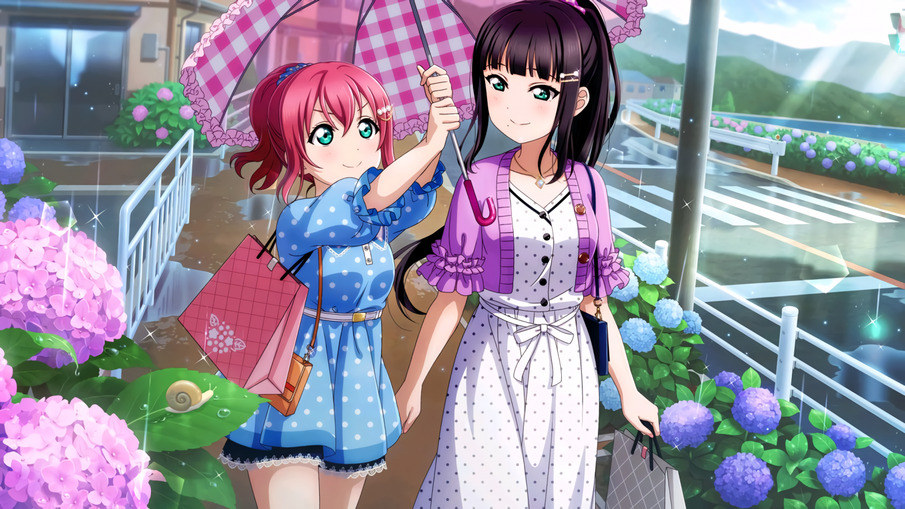
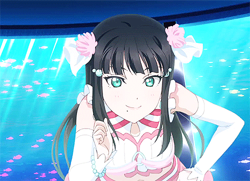

# Kurosawa Dia

Just another TS Discord Bot (Released Version = C# (yet))

(I'm in the process of transpilation for TypeScript, my last released version was in CSharp, you can check in here > [Last Version](https://github.com/Gabriel-Paulucci/KurosawaDia/tree/VersãoPublicada))

Aditional Informations:

My name is Kurosawa, I am a girl like the others, but I have a secret.....

I'm not a super hero, but I'm a nice person who can help you with your server and cheer you up a little...
If you give me a chance you might like it 😉
*(This gonna be updated as soon as possible...)*

## **How to contribute**

**If you want to contribute to my project and help creators to implement new and amazing features or report a dark error, you must follow the contribution rules mentioned [here](https://github.com/Gabriel-Paulucci/KurosawaDia/security/policy)**

---------------------------------

## Thanks For visiting me

## [Invite me for your server!](https://zuraaa.com/bots/389917977862078484/add)

## **Disclaimer**

**Kurosawa Dia is proprietary software, any changes or use outside the official released application is for personal use only, without permission for commercial use, *any inappropriate marketing attempts will be hunted under national law.***

---------------------------------
     Copyright © 2020 Gabriel-Paulucci & KuryKat
