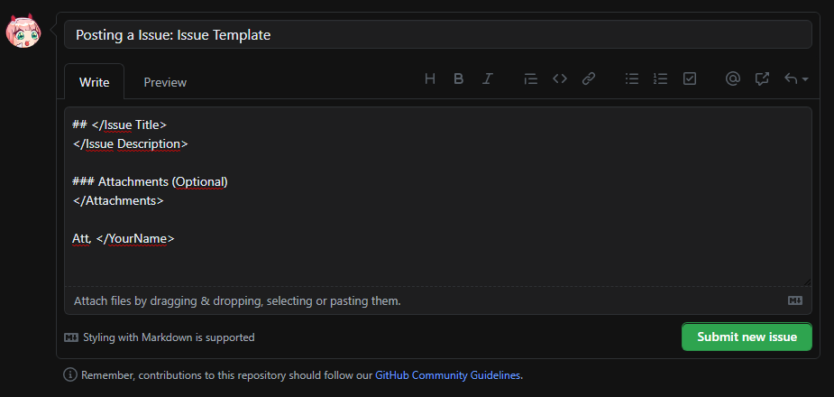
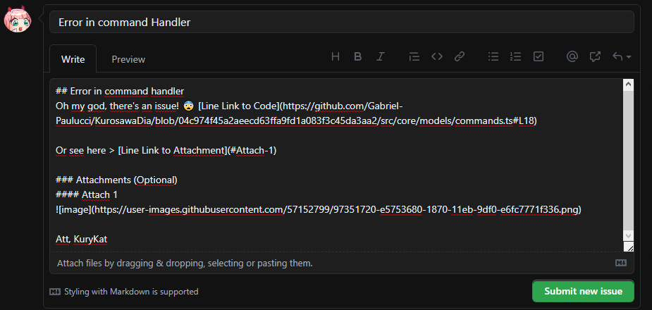
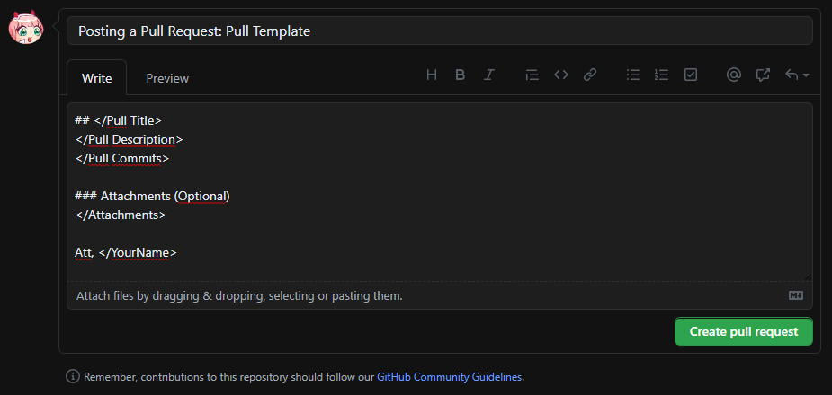

# Security Policy

## Supported Versions

| Version   | Supported          |
| --------- | ------------------ |
| 1.4.0     | :white_check_mark: |
| 1.3.4     | :white_check_mark: |
| < 1.3.3   | :x:                |

## **Disclaimer**
**Kurosawa Dia is proprietary software, any changes or use outside the official released application is for personal use only, without permission for commercial use, *any inappropriate marketing attempts will be hunted under national law.***

## Reporting a Vulnerability 
> (Issue and Pull Requests)

We prioritize organization above all, so if you want to contribute to the project you will have to follow some models and systems to report errors or release codes that are acceptable in the project

Please consider using this models before contribute, any posts without proper use of the model **will be ignored**.
* [Why?](#why-do-we-use-models)

## How to post a Issue 
### Model:

> ### Explaining each part of the model:

* **Post Title**: Make a very simple and quick summary of what the problem is, Example: "Grammatical Issue"
* **Issue Title**: Use the Post Title
* **Issue Description**: Make a description of the problem, what happened, where it happened, why it happened and with whom it happened, These are important questions to answer in this part of the post, you can also mention other issue or pull request by placing a "#" and the number of what you want to mention (a list will appear to help you)
* **Attachments (Optional)**: Attach files, images, videos, links, etc, that you consider important to be seen so that we can understand your problem with more certainty and be able to fix it as soon as possible.
* **Signature**: Put your name here, it will be beautiful and more organized

### Example:

## How to post a Pull Request
Wow, did you make a code to assist us in our project and want us to accept your code? So for that you will have to follow our business rules, commit models and pull request models

### How to be accepted on a pull request?
* [Commit Model](docs/commitModel.md) in all your commits
* [Code Model](docs/codeModel.md) in your code
* *This pull request model below*

### Model:

> ### Explaining each part of the model:

* **Post Title**: Make a very simple and quick summary of what the Pull is, Example: "Add new emotes" [*Remember to use the [commits model](docs/commitModel.md)*]
* **Pull Title**: Use the Post Title
* **Pull Description**: Make a description of the contribution, what you did, what it is for and why, you can also mention other issue or pull request by placing a "#" and the number of what you want to mention (a list will appear to help you)
* **Pull Commits**: Make a list (using markdown) of the commits you made in this pull
* **Attachments (Optional)**: Attach files, images, videos, links, etc., that you consider important to be seen so that we can more easily accept your additions or changes in our project.
* **Signature**: Put your name here, it will be beautiful and more organized

### Example:

 

## Why do we use models?
We have an automatic system that receives issues and posts to us in a faster way, so we can fix them faster, without using the template the system does not detect your post and simply closes it automatically, besides, everything with models is more organized and more professional

### Navigation
> [Back to Main README](../README.md)

     Copyright © 2020 Gabriel-Paulucci & KuryKat